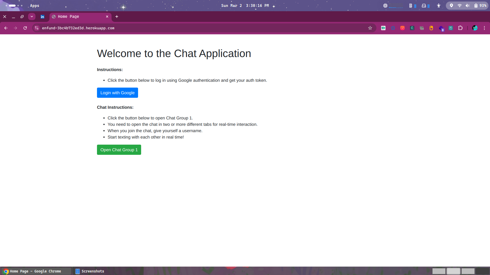
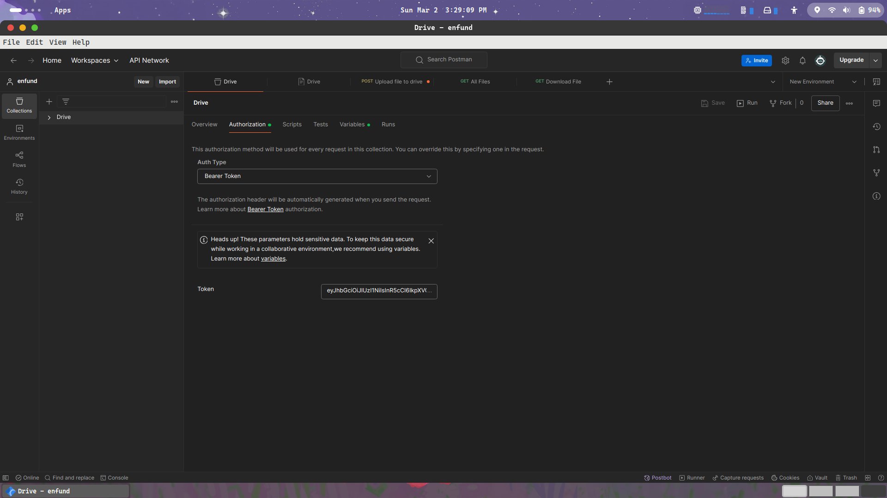
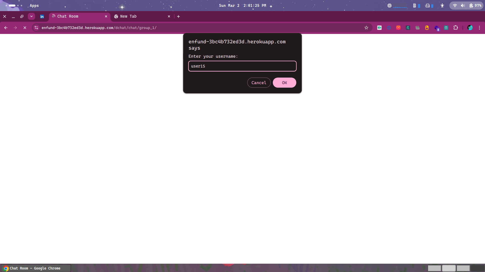
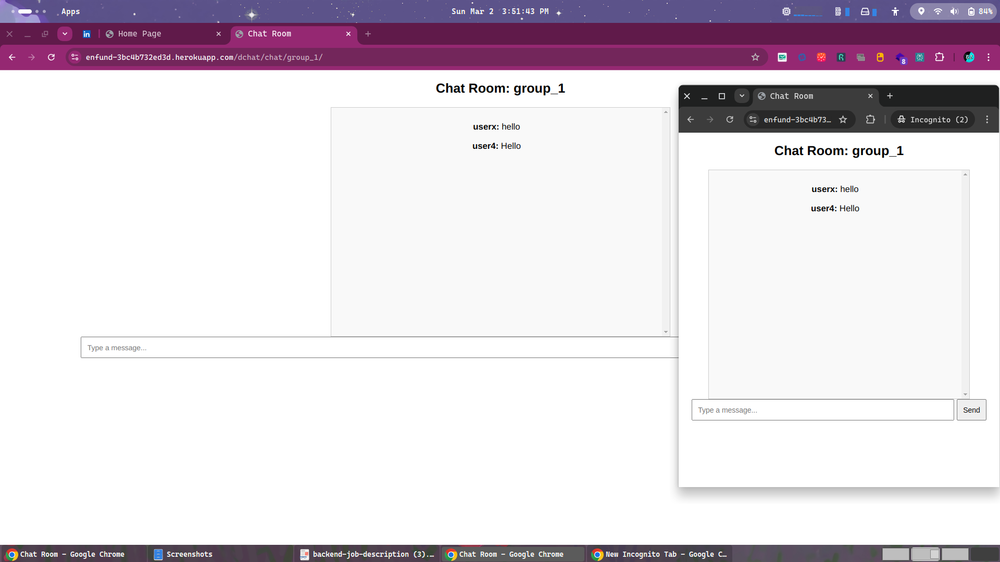

## Home Page Instructions

### Authentication:
- Click the **Login with Google** button to authenticate using Google OAuth 2.0.
- Once authenticated, you will receive an access token in the following format:

```json
{
  "message": "User authenticated successfully!",
  "user": {
    "id": 1,
    "email": "user@example.com",
    "name": "John Doe"
  },
  "tokens": {
    "refresh": "<refresh_token>",
    "access": "<access_token>"
  }
}
```
- Copy the `access_token` and paste it into **Postman** under **Authorization**.
- Select **Bearer Token** and input your access token for authentication.


## Chat Instructions
- Click the **Open Chat Group 1** button.
- Open the chat in **two or more browsers** for real-time interaction.
- **Most impotent think don't open in two diffrent tabs of same browser You can Use Incognito of same browser**
- When you join, set your **username**.
- Start texting with each other in **real time**!




## API Documentation
All API endpoints and details regarding **Google Drive integration** are available in the **Postman collection**. Refer to the Postman documentation for specific request structures and parameters.

## Features
- **Google OAuth 2.0 Authentication**
- **Google Drive File Upload & Fetching**
- **Real-time messaging** using WebSockets
- **Multi-tab communication support**
- **Postman API Collection for detailed request handling**


## Setup & Installation
1. Clone the repository:
   ```sh
   git clone https://github.com/your-repo/chat-app.git
   ```
2. Navigate to the project directory:
   ```sh
   cd chat-app
   ```
3. Install dependencies:
   ```sh
   pip install -r requirements.txt  # If using Python
   ```
4. Start the application:
   ```sh
   python manage.py runserver  # Django
   ```

## License
This project is licensed under the MIT License.

## Contact
For any queries, feel free to reach out.


